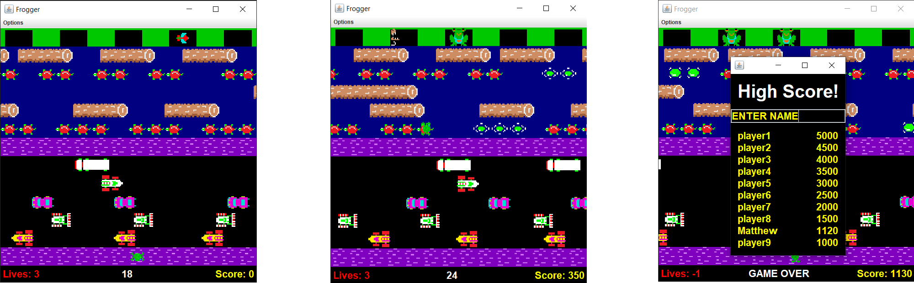

# Description
Frogger Clone is a re-creation of the classic arcade game Frogger. I wrote the game over the course of a week as my final project in Computer Science II. The project is coded 100% in Java, and was built to showcase an understanding of Object Oriented Programming and Model-View-Controller Architecture.

# Snapshot


Video Demonstration: https://www.youtube.com/watch?v=FbcctMlml7E

# Build Instructions
To build the program in a Windows environment:
```
1. > cd FroggerClone-main
2. > javac logic/Frogger.java
3. > java logic/Frogger
```

# Possible Improvements
* More authentic HUD
* Adding Sound FX
* Designing More Levels

# Known Bugs
* Occasional input disregard
* Winning frog disappears with fly if caught
* Frog orientation does not reset with game

# Contributions & Licensing
This project is closed to development, however feel free to fork and use any part of the codebase.

# Acknowledgements
Art assets courtesy of https://www.classicgaming.cc/classics/frogger/icons 
